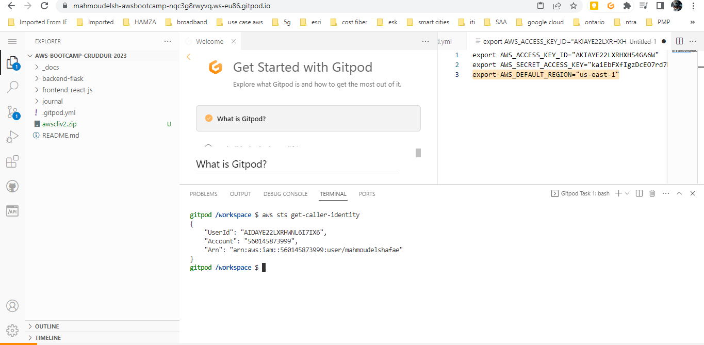
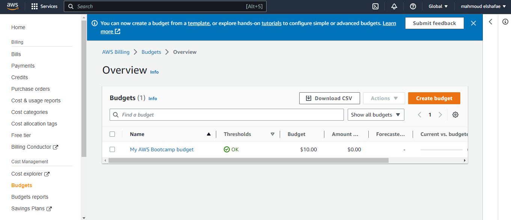
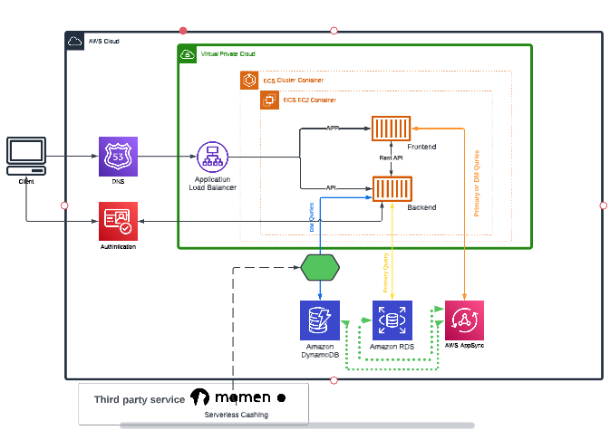

# Week 0 — Billing and Architecture

## Required Homework/Tasks

### Install and Verify AWS CLI 

### Create a Budget

I created my  Budget for $10.

### Recreate Logical Architectural Deisgn

[Lucid Charts Share Link](https://lucid.app/lucidchart/e5731eab-9c58-49d1-9524-8dd7692a903d/edit?viewport_loc=-517%2C-30%2C2881%2C1345%2C0_0&invitationId=inv_5a0f36c3-a83d-4a79-b357-bc40e9790b20
)

