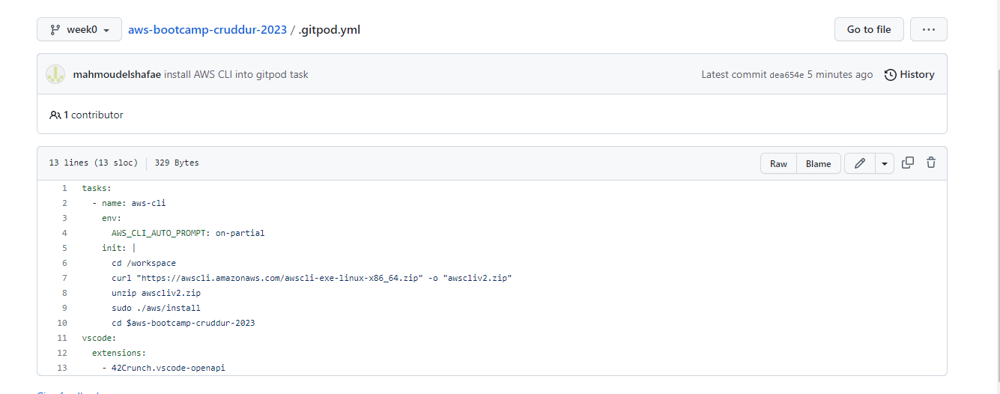

# Week 0 — Billing and Architecture

## Required Homework/Tasks

### Install AWS CLI

- We are going to install the AWS CLI when our Gitpod enviroment lanuches.
- We are are going to set AWS CLI to use partial autoprompt mode to make it easier to debug CLI commands.
- The bash commands we are using are the same as the [AWS CLI Install Instructions]https://docs.aws.amazon.com/cli/latest/userguide/getting-started-install.html


Update our `.gitpod.yml` to include the following task.

```sh
tasks:
  - name: aws-cli
    env:
      AWS_CLI_AUTO_PROMPT: on-partial
    init: |
      cd /workspace
      curl "https://awscli.amazonaws.com/awscli-exe-linux-x86_64.zip" -o "awscliv2.zip"
      unzip awscliv2.zip
      sudo ./aws/install
      cd $aws-bootcamp-cruddur-2023
```



### Create a new User and Generate AWS Credentials

- Go to (IAM Users Console](https://us-east-1.console.aws.amazon.com/iamv2/home?region=us-east-1#/users) mahmoud elshafae create a new user
- `Enable console access` for the user
- Create a new `Admin` Group and apply `AdministratorAccess`
- Create the user and go find and click into the user
- Click on `Security Credentials` and `Create Access Key`
- Choose AWS CLI Access
- Download the CSV with the credentials

### Set Env Vars

We will set these credentials for the current bash terminal
```
export AWS_ACCESS_KEY_ID=""
export AWS_SECRET_ACCESS_KEY=""
export AWS_DEFAULT_REGION=us-east-1
```

We'll tell Gitpod to remember these credentials if we relaunch our workspaces
```
gp env AWS_ACCESS_KEY_ID=""
gp env AWS_SECRET_ACCESS_KEY=""
gp env AWS_DEFAULT_REGION=us-east-1
```
### Check that the AWS CLI is working and you are the expected user

```sh
aws sts get-caller-identity
```

### Install and Verify AWS CLI 


### Create a Budget

I created my  Budget for $10.


### Recreate Logical Architectural Deisgn


[Lucid Charts Share Link](https://lucid.app/lucidchart/e5731eab-9c58-49d1-9524-8dd7692a903d/edit?viewport_loc=-517%2C-30%2C2881%2C1345%2C0_0&invitationId=inv_5a0f36c3-a83d-4a79-b357-bc40e9790b20
)


