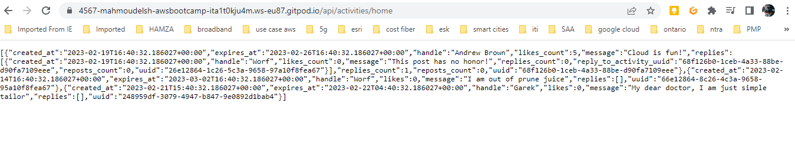
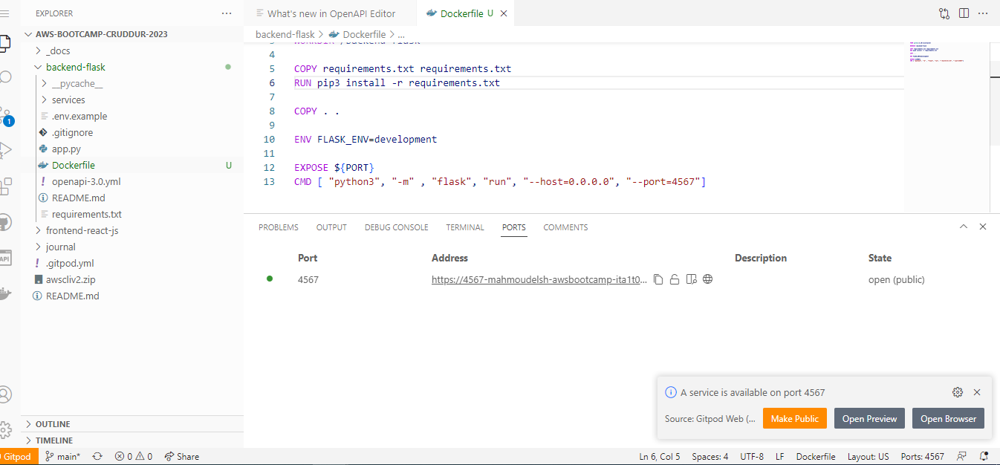
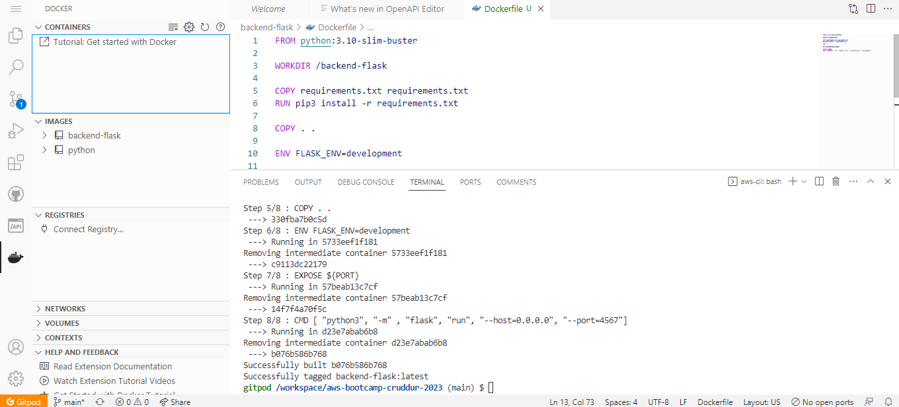
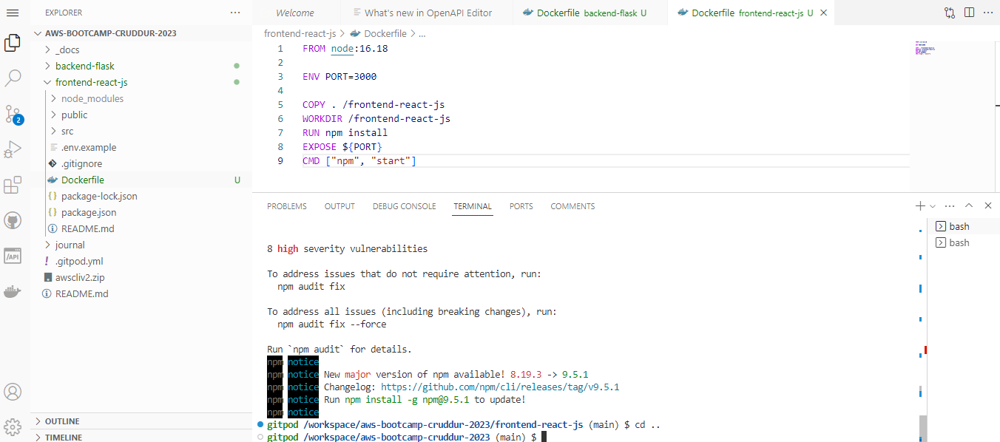
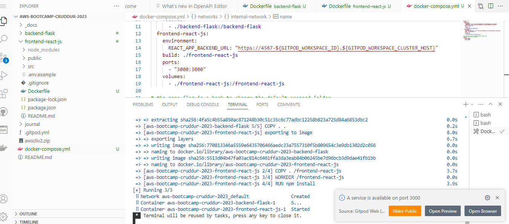
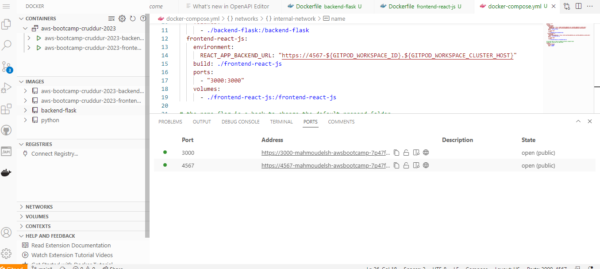
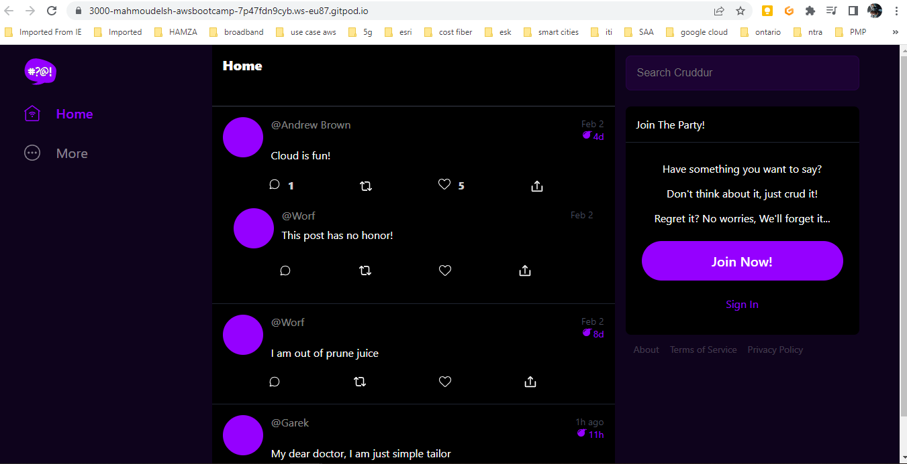
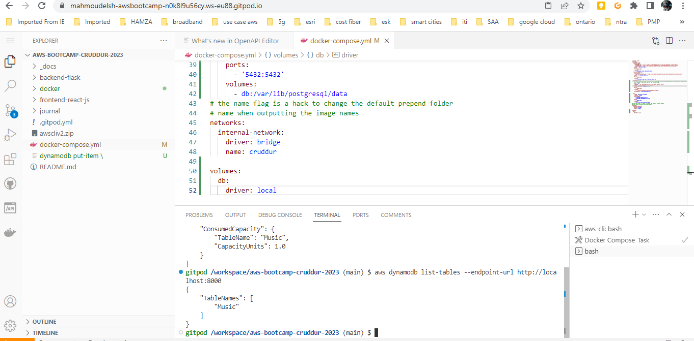
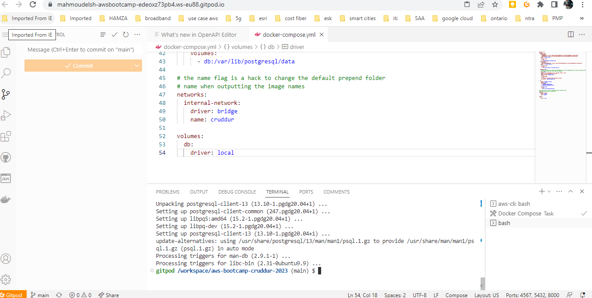
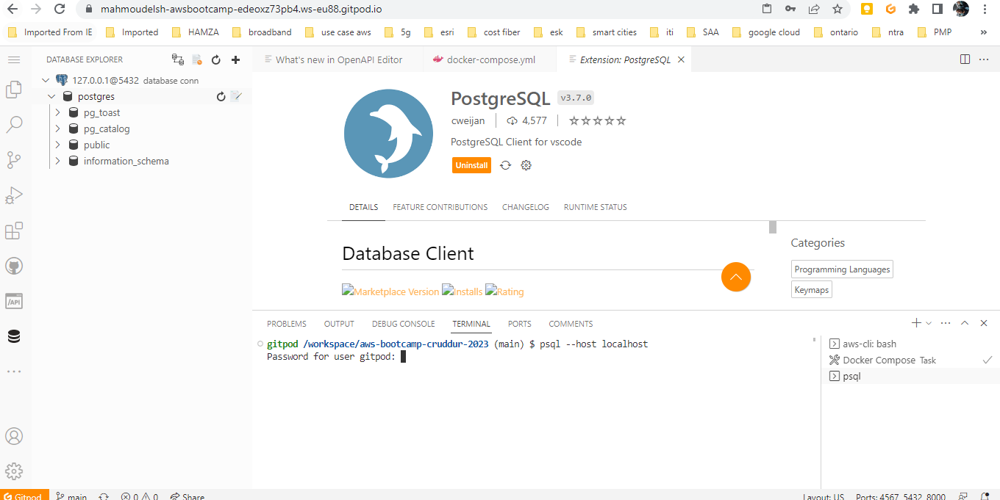

# Week 1 — App Containerization

## Containerize Backend

### Run Python

```sh
cd backend-flask
export FRONTEND_URL="*"
export BACKEND_URL="*"
python3 -m flask run --host=0.0.0.0 --port=4567
cd ..
```


### Add Dockerfile

Create a file here: `backend-flask/Dockerfile`

```dockerfile
FROM python:3.10-slim-buster

WORKDIR /backend-flask

COPY requirements.txt requirements.txt
RUN pip3 install -r requirements.txt

COPY . .

ENV FLASK_ENV=development

EXPOSE ${PORT}
CMD [ "python3", "-m" , "flask", "run", "--host=0.0.0.0", "--port=4567"]
```


### Build Container

```sh
docker build -t  backend-flask ./backend-flask
```


### Run Container

Run 
```sh
docker run --rm -p 4567:4567 -it -e FRONTEND_URL='*' -e BACKEND_URL='*' backend-flask
```
## Containerize Frontend

## Run NPM Install

We have to run NPM Install before building the container since it needs to copy the contents of node_modules

```
cd frontend-react-js
npm i
```

## Multiple Containers

### Create a docker-compose file

Create `docker-compose.yml` at the root of your project.

```yaml
version: "3.8"
services:
  backend-flask:
    environment:
      FRONTEND_URL: "https://3000-${GITPOD_WORKSPACE_ID}.${GITPOD_WORKSPACE_CLUSTER_HOST}"
      BACKEND_URL: "https://4567-${GITPOD_WORKSPACE_ID}.${GITPOD_WORKSPACE_CLUSTER_HOST}"
    build: ./backend-flask
    ports:
      - "4567:4567"
    volumes:
      - ./backend-flask:/backend-flask
  frontend-react-js:
    environment:
      REACT_APP_BACKEND_URL: "https://4567-${GITPOD_WORKSPACE_ID}.${GITPOD_WORKSPACE_CLUSTER_HOST}"
    build: ./frontend-react-js
    ports:
      - "3000:3000"
    volumes:
      - ./frontend-react-js:/frontend-react-js

# the name flag is a hack to change the default prepend folder
# name when outputting the image names
networks: 
  internal-network:
    driver: bridge
    name: cruddur
```






## Adding DynamoDB Local and Postgres

### DynamoDB Local

```yaml
services:
  dynamodb-local:
    # https://stackoverflow.com/questions/67533058/persist-local-dynamodb-data-in-volumes-lack-permission-unable-to-open-databa
    # We needed to add user:root to get this working.
    user: root
    command: "-jar DynamoDBLocal.jar -sharedDb -dbPath ./data"
    image: "amazon/dynamodb-local:latest"
    container_name: dynamodb-local
    ports:
      - "8000:8000"
    volumes:
      - "./docker/dynamodb:/home/dynamodblocal/data"
    working_dir: /home/dynamodblocal
```




### Postgres

```yaml
services:
  db:
    image: postgres:13-alpine
    restart: always
    environment:
      - POSTGRES_USER=postgres
      - POSTGRES_PASSWORD=password
    ports:
      - '5432:5432'
    volumes: 
      - db:/var/lib/postgresql/data
volumes:
  db:
    driver: local
```
To install the postgres client into Gitpod

```sh
  - name: postgres
    init: |
      curl -fsSL https://www.postgresql.org/media/keys/ACCC4CF8.asc|sudo gpg --dearmor -o /etc/apt/trusted.gpg.d/postgresql.gpg
      echo "deb http://apt.postgresql.org/pub/repos/apt/ `lsb_release -cs`-pgdg main" |sudo tee  /etc/apt/sources.list.d/pgdg.list
      sudo apt update
      sudo apt install -y postgresql-client-13 libpq-dev
```






## Volumes

directory volume mapping

```yaml
volumes: 
- "./docker/dynamodb:/home/dynamodblocal/data"
```

named volume mapping

```yaml
volumes: 
  - db:/var/lib/postgresql/data

volumes:
  db:
    driver: local
```


